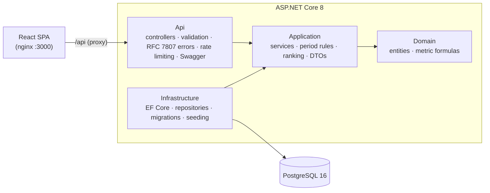

# Sales Performance Dashboard

A sales analytics dashboard for DJI-Market.ru: revenue, gross profit, margin, average check,
manager ranking, category and product breakdown, and the latest sales, for any period, compared with
the period before.

**Stack:** React 18 + TypeScript (Vite, TanStack Query, Tailwind, Recharts, Framer Motion) ·
ASP.NET Core 8 + EF Core 8 · PostgreSQL 16 · Docker Compose.

## Run it

The only requirement is Docker.

```bash
docker compose up --build
```

| What | Where |
|---|---|
| Dashboard | http://localhost:3000 |
| API + Swagger | http://localhost:8080/swagger |
| PostgreSQL (for psql / DBeaver) | `localhost:5434`, db `sales_dashboard`, user/password `postgres` |

On start, the API applies the EF Core migrations and seeds 12 months of realistic data (about 4,800
sales, 19 managers, 8 categories). The frontend waits until the API healthcheck passes, so the first
page load already shows data. A cold start takes about 20 seconds.

`docker compose down` stops the stack and keeps the data. `docker compose down -v` also deletes it,
and the next start seeds a fresh database.

### Tests

Everything runs in containers, the same way as in CI:

```bash
docker build --target test backend    # 109 unit tests (xUnit)
docker build --target test frontend   # typecheck + 26 tests (Vitest, Testing Library, MSW)
```

## Business rules

These are the decisions behind the numbers. They are also covered by unit tests.

- **Only paid sales count.** Revenue, gross profit, margin, sales count and average check include
  only `Paid` sales. `Cancelled` and `Refunded` sales are excluded, and the dashboard says so under
  the KPIs (count and amount of each), so the numbers never look wrong without an explanation.
- **Revenue** = sum of line amounts after discounts. **Gross profit** = revenue minus cost of goods.
  **Margin** = gross profit / revenue. **Average check** = revenue / number of paid sales.
- **Previous period** = the window of the same length right before the selected one. The month presets
  are calendar-aligned (This month is compared with the same days of last month; Last month with the
  month before it).
- **Time zone:** all periods are whole days in UTC, and the UI says so. One rule everywhere avoids
  numbers that change with the viewer's time zone.
- **Changes:** percent change for amounts; percentage points for margin. No comparison is shown (a
  dash, not "+∞ %") when the previous period is zero.
- **Manager ranking** can be sorted by gross profit (default), revenue, average check or margin.
  Ties share a rank, managers without sales are listed at the bottom, and the rank change against
  the previous period is shown.
- `Sale` stores `TotalAmount` and `TotalCost` (denormalised from its lines when it is created), so the
  KPI queries do not join the line items.

## Architecture



Four projects with dependencies pointing inwards: Domain depends on nothing, Application defines the
repository interfaces, and Infrastructure implements them with EF Core.

**Why the layers, when the brief warns against over-engineering:** the value of this project is in
the metric rules (what counts, how the previous period is chosen, how ties rank). The layers keep
those rules in plain C# with no database, so 109 tests cover them in milliseconds. There is no
CQRS, MediatR, event bus or generic repository. Each repository has the few aggregate queries the
dashboard needs, and every query runs in PostgreSQL (`GROUP BY`), not in memory.

**API** (`/api/v1`, all `GET`, all take `preset` or `from`/`to`):
`dashboard/summary`, `dashboard/trend`, `dashboard/managers`, `dashboard/categories`,
`dashboard/products/top`, `sales` (paged). Errors use `application/problem+json`: 400 with one error
per field, 429 with `Retry-After`, 500 with a `traceId`.

**Indexes** (all in the `InitialCreate` migration):

| Index | Used by |
|---|---|
| `sales (status, sold_at) INCLUDE (manager_id, total_amount, total_cost)` | KPI sums and trend, index-only |
| `sales (manager_id, sold_at)` | manager ranking |
| `sales (sold_at, id)` | latest sales, newest first, stable paging |
| `sale_items (sale_id) INCLUDE (product_id, quantity, unit_price, unit_cost)` | category and product breakdown |
| `sale_items (product_id)`, `products (category_id)` | joins |

**Frontend:**
- One query per dashboard block, so blocks load in parallel and one failing endpoint shows its own
  error with a Retry button instead of blanking the page.
- The previous data stays on screen, dimmed, while a new period loads.
- The whole state (period, sort orders, filter, page, language) lives in the URL, so any view can be
  shared as a link.
- Russian (default) and English, with correct plurals and number formats.
- Light and dark theme: the first visit follows the OS setting, and after that the last choice is
  remembered.

## Repository layout: one repo on purpose

```
backend/     ASP.NET Core solution (src/ + tests/), Dockerfile with build/test/runtime stages
frontend/    React app, Dockerfile (test stage + nginx runtime), nginx.conf
docs/        SCALING.md — what changes with millions of sales and many writers
.github/     CI workflow
docker-compose.yml
```

In a real team I would keep the **backend and frontend in separate repositories**, each with its own
pipeline, versioning and release cycle, and the API contract (OpenAPI) as the link between them. For
this test, a single repository is the better choice: the reviewer clones one thing, runs one
command, and sees the whole feature (a backend change and the UI that uses it) in the same history.

## Git history: an honest note

The brief asks for meaningful commits, and normally I commit and push many times a day in small
steps. Today my work schedule did not allow it: I built the project in one long session, and the
first push happened at the end. The history is therefore split into a few commits by area (backend,
frontend, infrastructure, docs), made at push time. The timestamps are real, not rewritten. The
real step-by-step record of how the work went is in [`AI_PROMPTS.md`](AI_PROMPTS.md), with the
time of each step.

## CI/CD

[`.github/workflows/ci.yml`](.github/workflows/ci.yml) runs on every push and pull request:

1. backend unit tests (`docker build --target test backend`),
2. frontend typecheck and tests (`docker build --target test frontend`),
3. a smoke test: `docker compose up --build --wait`, then every API endpoint is called through the
   nginx proxy.

CI uses the same Dockerfiles as local development, so "works on my machine" and "works in CI" are the
same statement.

**CD is not set up**, because there is no target environment for a test task. With one, I would
add: build the images once and push them to GitHub Container Registry with the commit SHA as the tag,
deploy that exact image to staging automatically, promote it to production with a manual approval,
run migrations as a separate step before the new version takes traffic (not on API start as here),
and keep secrets in the platform's secret store instead of `docker-compose.yml`.

## Not done, and what I would add for production

- **Integration tests** against a real PostgreSQL (Testcontainers) for the repository queries. The
  metric rules are unit-tested; the SQL is today checked by the smoke test and manually.
- **Authentication and roles** (a manager sees their own numbers, the head of sales sees everyone).
- **Secrets:** the database password is in `docker-compose.yml` for a one-command start. In
  production it comes from a secret store.
- **Migrations** as a deployment step, not at API start-up (fine for one instance, racy for many).
- **Observability:** structured logs to a central store, metrics and traces (OpenTelemetry), and
  alerting on the health endpoint.
- **Caching** of aggregates for closed periods (last month does not change).
- **Scaling** past millions of sales and many writers: see [`docs/SCALING.md`](docs/SCALING.md).
  Only rate limiting is implemented; the rest is a plan, because the brief asks not to add
  distributed architecture to a small system.
- **Mobile layout:** the brief targets a desktop dashboard (~1440×900). Below 1280 px the page scrolls
  sideways.

## About the author and AI

I am still learning Russian. The brief is in Russian and I worked from it without problems. The code
and documentation are in English so they are easy to review; the seed data uses Russian names so the
dashboard looks like a product for the Russian market.

I built this with an AI coding agent (Claude Code). How I used it, where it went wrong, and how the
result was checked are in [`AI_NOTES.md`](AI_NOTES.md). Every prompt, word for word, is in
[`AI_PROMPTS.md`](AI_PROMPTS.md).
